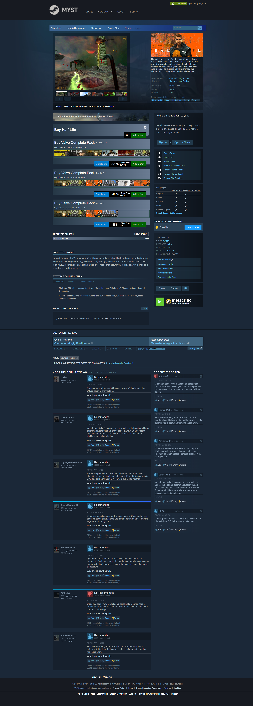

# Myst

## Description
Myst is a full-stack replication of a steam product page built in a week by a global remote development team of 4 people.

## Table of Contents
* [Installation](#installation)
* [Usage](#usage)
* [Screenshot](#screenshot)
* [Contributors](#contributors)
* [Tech](#tech)
* [Questions](#questions)
* [License](#license) 

## Installation
1. Inside of the server folder, with docker installed run: docker compose up --build
2. Inside of the client folder, with node installed, run: npm install
3. To get the application running, run: npm run dev
4. Go to http://localhost:5173/ in your favorite browser

## Usage
This is purely a educational project, the goal was to be able to expand our knowledge of react while building a product page replica.

## Screenshot

## Contributors
* https://github.com/Alphie1028
* https://github.com/kevin-foreman
* https://github.com/billytomasello
* https://github.com/andmoo71

## Tech
* Front End: React, Slick
* Back End: Express.js, Faker.js
* Databse: Postgresql
* Tools: Postman, Docker, Chrome Dev Tools, GitLabs, GitHub

Contact information (email address & GitHub username) of the developer
## Questions
brennan.a.mulligan@gmail.com (email)
https://github.com/Alphie1028 (Github)

## License

The license used for this project is MIT.

